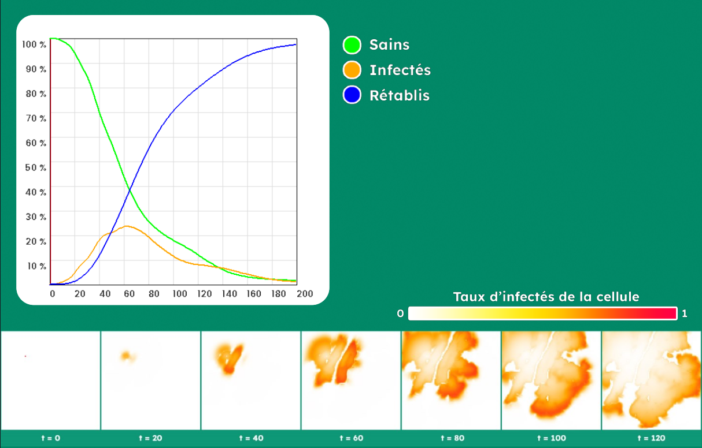
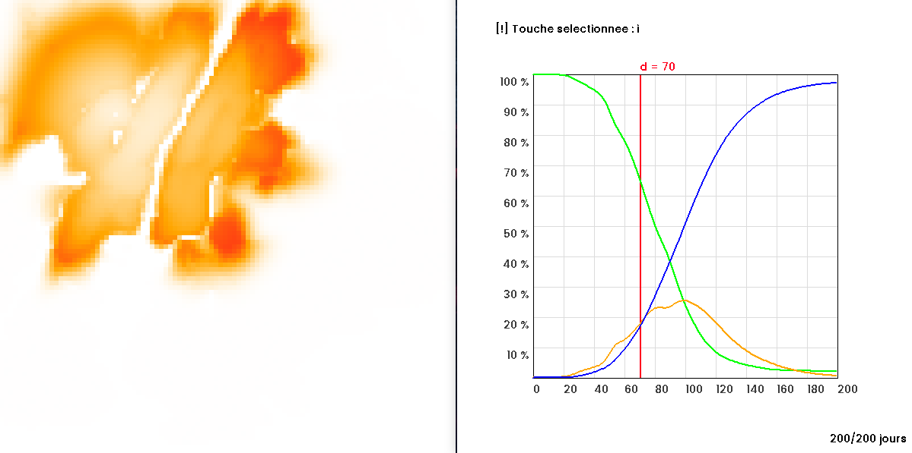
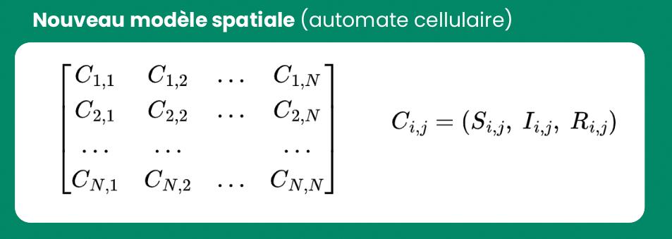
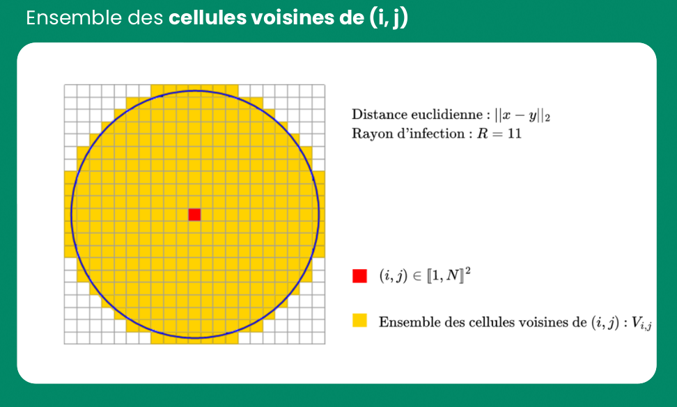
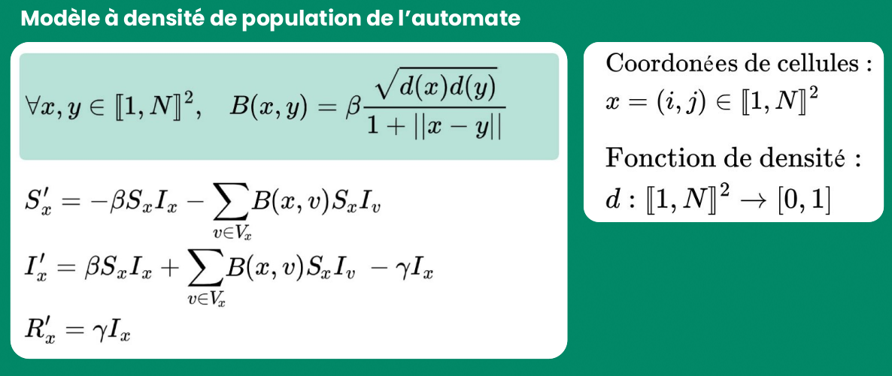
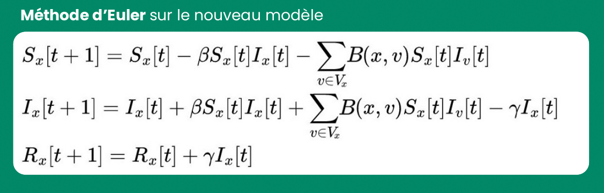
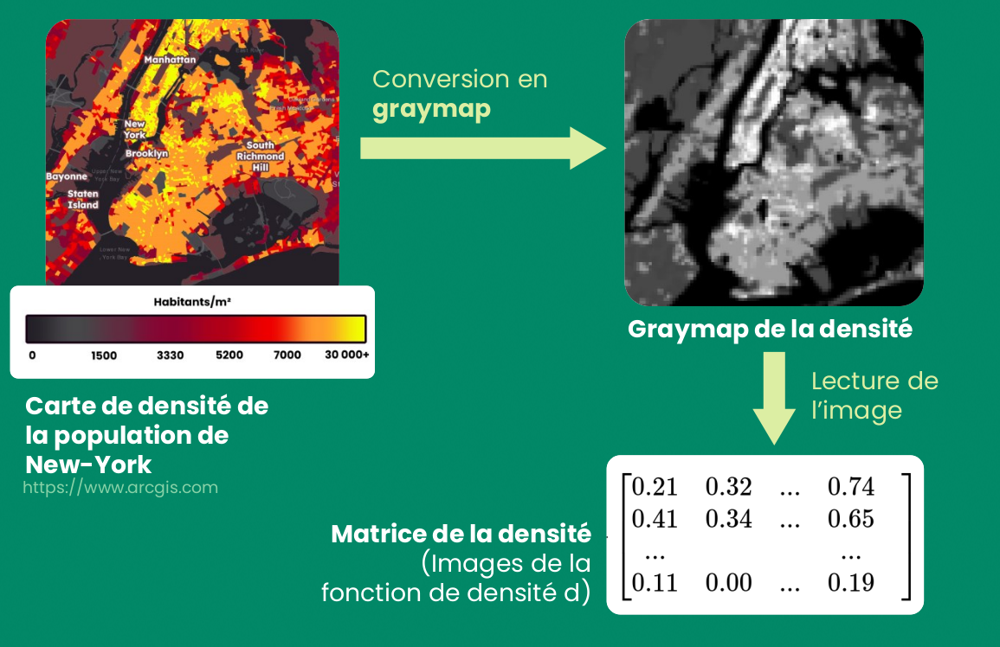

# Automate cellulaire SIR

Cet automate cellulaire est basé sur une **modélisation compartimentale en épidémiologie** (type SIR). 

Il divise la population en 3 compartiments : **Sain, Infecté, Rétabli.**
Et étudie la propagation d'une épidémie (défini par des **paramètres**), au cours du temps, dans un **espace discrétisé** en deux dimensions.

Le modèle prend en compte l'**hétérogénéité spatiale de la densité de population** avec des **fonctions** ou des **matrices de densité**. 

On peut ainsi étudier l'évolution d'une épidémie sur New-York :


## 🔧 - Installation 


### 1 - Installation de SDL2 & SDL2_ttf

```shell
sudo apt-get install libsdl2-dev
sudo apt-get install libsdl2-ttf-dev
```

### 2 - Modification des paramètres via le code

Vous pouvez modifier les paramètres de la simulation, en modifiant les variables du fichier ```src/var.c```

**Par exemple :** 
* Modifier le taux d'infection, de rétablissement, le nombre de cellules...
* Modifier le rayon de propagation
* Modifier la *graymap* de la matrice de densité ou modifier la fonction de densité.
* Afficher les proportions d'infectés sommés


### 2 - Compilation & Exécution

```shell
make
./sir
```

## 👀 - Utilisation

### Touches :

Différentes touches permettent la visualisation de la modélisation où la modification des paramètres :

- ```←``` ou ```→``` : Défiler les jours.
- ```↵``` : Relancer la simulation.
- ```i``` ou ```r``` : Sélectionner le taux d'infection ou de rétablissement.
- ```j``` : Sélectionner le nombre de jours.
- ```↑``` ou ```↓``` : Augmenter ou diminuer le paramètre sélectionné.

### Graphiques :

À **gauche**, se trouve une visualisation de l'automate cellulaire. La proportion de la population infectée de chaque cellule est représentée par une couleur (**Blanc** : pas de population infectée, **Rouge** : toute la populations de cette cellule est infectée).

À **droite** un graphique montrant l'évolution de la réparition de la population entre chaque compartiment.
- En vert : la population saine
- En jaune : la population infectée
- En bleu : la population rétablie (vaccinée)



## 📚 - Explication du modèle

On discrétise l'espace 2D en un ensemble de **cellules** à trois composantes, la proportion d'individus sains, infectés et rétablis.




On définit un ensemble de **cellules voisines** $V_x$ pour chaque cellule $x$ en fonction d'un **rayon d'infection** $R$.




On définit une **fonction d'infection** $B$ qui renvoi le taux d'infection entre deux cellules $x$ et $y$. Elle est calculée en fonction de la **densité** de population aux coordonnées des cellules (donnée par la **fonction de densité**) et de la distance qui les sépare.

On définit les intéractions **intra-cellulaires** (échange de population entre les compartiments de la cellule) et **extra-cellulaires** (échange de population avec les **cellules voisines** $v$ de la cellule $x$) par un système d'équation différentielles.




On résout numériquement ce système d'équations différentielles non-linéaires avec la méthode de Newton.




On peut modéliser la densité de l'automate cellulaire par une fonction de densité constante ou gaussienne de densité, mais aussi par une matrice de densité se basant sur des cartes de densité de la population.


